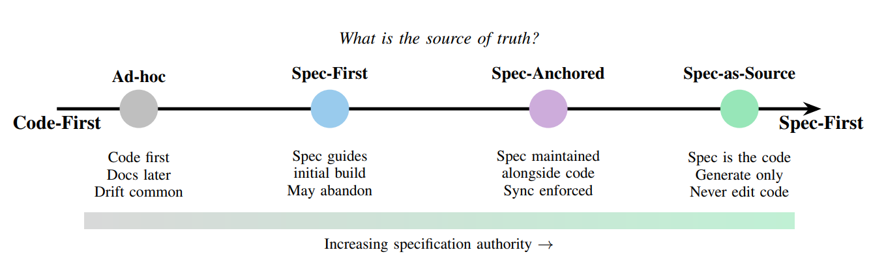

# specs-manager

A portable **spec-driven development** toolkit for Claude Code. Drop it into
any repository — a front end, a back end, a library — to get a structured
requirements → design → tasks → implement → commit → verify workflow,
enforced by a hook rather than by hoping everyone remembers the process.

> **Important:** none of the theory below is mine. I just rewrote and
> compiled the information from this technical report:
> [Spec-Driven Development: From Code to Contract in the Age of AI Coding Assistants](https://arxiv.org/pdf/2602.00180).
> Feel free to read it and form your own idea of what spec-driven
> development is and how it should work.

## Why

Over time, software development has always pursued a way to manage software
from a **single source of truth**. Many frameworks and models were born from
this specific idea — **TDD** and **BDD**, for example. The thing is,
documentation was written and then became outdated, and diagrams were
designed, then changed and never updated. So, over time, the only way to
feel confident about what the software was and how it worked was to look
directly at the code. That's how **the code became the source of truth** in
software companies everywhere.

That's why **spec-driven development** came to the surface. It offers an
alternative where we can have high trust in the documentation, and the code
itself is just a derivative of that documentation (the **specification**).
It comes with many advantages; the most important one is that **humans and
machines can speak the same language**. This could only become true with
the help of AI, which works as the catalyst that makes it possible.

> "The problem is simple: AI models are excellent at pattern completion but
> poor at mind reading." — [Spec-Driven Development](https://arxiv.org/pdf/2602.00180) [1.A]

Suppose you want to implement a way to authenticate the users of your
platform, so you prompt any AI assistant: *"please add the authentication
layer to my project"*. The thing here is that you are leaving a lot of
information up in the air — information the AI needs to fulfill your
requirement, for example:

- What kind of authentication do you need?
- Are your users confidential or public?
- Do you need any protection against attacks over the authentication?
- Which cryptographic algorithm do you want to use?

The AI can only answer these questions by making assumptions about your
requirement, and in most cases it builds something very complex, completely
outside of what you asked for (that's what people call **vibe coding**).

Now imagine you say instead: *"I need to add a simple authentication layer
where my users can authenticate with a username and password. Hash their
passwords with bcrypt, and add a honeypot and a rate limiter to the process
to prevent attacks. Keep it simple — it's only for confidential users."*
That's different, right? The AI has enough context and information to build
exactly what you need and comply with all your requirements. **That's the
power of spec-driven development**: it lets you write a complete spec of
your requirements, so the AI doesn't have to decide on its own which way to
go.

## Spec-driven models

There are three different ways to apply this methodology:

1. **Spec-first** — the developer or the team writes an initial
   specification for the feature, often a user story or a detailed
   requirement. The spec defines the starting point, but once the feature is
   finished the spec drifts and the code becomes the source of truth again,
   so any change made after the implementation is no longer reflected in the
   initial documentation.

   It is particularly useful when you write new functionality with an AI
   assistant: the specification keeps the AI from guessing characteristics
   of the requirement.

2. **Spec-anchored** — a middle point, where both the codebase and the specs
   evolve whenever either of them changes, often coordinated by tests. This
   approach is **more expensive** than spec-first, because it takes more
   discipline and consistency to keep everything up to date. You can set up
   a suite of tests that runs on every commit to keep both artifacts in
   sync.

3. **Spec-as-source** — this approach turns the traditional way of
   developing around. The spec becomes the source of truth, and every change
   to the code has to be made through its spec: if you want to change
   something, you change the spec and implement everything again. This
   approach isn't new — we already have technologies that use it, such as
   **OpenAPI**, where you declare your endpoints in the documentation and
   then generate them from it.



*Source: [Exploring Generative AI — martinfowler.com](https://martinfowler.com/articles/exploring-gen-ai.html)*

> **This toolkit follows the spec-first approach.** Although Claude is the
> main developer in this process, we play the role of supervisor: we read
> everything that was generated, bring it in line with our rules, standards
> and architecture, and make sure it works as expected.

## Rules

Before describing the workflow itself, it's important to talk about
**rules**. Rules are the boundaries we define for Claude: folder structure,
naming conventions, responsibility layers, styling, testing. They tell
Claude how it has to develop everything — how to name things, what
architecture we chose — and they keep the same standard across all the
code. Without them, Claude could use different technologies, approaches and
architectures every time.

Rules are **out of the scope of this project**, because they change between
companies and stacks: they live in your own repository, in `.claude/rules/`,
next to the workflow contract this toolkit adds. Still, defining them is the
first step to making sure everything works nicely.

## Workflow

The workflow is composed of a set of **skills**. At each step of the
process, Claude (or any AI assistant) runs a skill and produces an
**artifact** — the most important and representative part of this model. An
artifact is the output of a step: a Markdown file holding everything that
was defined in it. You can, and should, read each artifact, understand it,
reorganize it, and only then continue with the next step. That is what lets
us keep control over what we are going to build and how Claude will build
it.

```
requirements → design → tasks → implement → commit → verify
```

Each step needs your explicit approval before the next one begins, and the
current phase of a spec is stored in `specs/<NNN>-<slug>/.status`. Below are
the skills involved and the artifact each one creates.

### 1. `/spec-new` — requirements

This is the initial skill. Run it with a brief description of what you are
going to build. There is also a folder,
[`specs/source-material/`](specs/source-material/README.md), where you can
drop documents with additional information for the requirement — data
formats, input data, connections, initial requirements, prototypes.

Here we define exactly what our software has to achieve to be considered a
quality implementation:

- **acceptance criteria**;
- **input and output conditions** (preconditions and postconditions);
- **business rules**.

Claude reads everything you provide, asks whatever it needs to build the
requirement, and writes the artifact **`requirements.md`** with all that
information grouped together, following the template
[`.claude/templates/requirements.md`](.claude/templates/requirements.md),
which defines what each requirement has to include. Once you finish your
review, you can ask Claude to rewrite anything, or just continue.

This step tells us **WHAT** the software should do.

### 2. `/spec-design` — design

This step defines where the changes are going to be made: which structure,
which technologies and which restrictions apply. It is the most technical
step, and the point to tell Claude how to structure everything, where the
data comes from, and which patterns to follow. If you need
a specific technology, or have to connect to a specific service, this is the
place.

The artifact is **`design.md`**, with the whole solution described,
including specific implementation parts — controllers, repositories, types,
utils, components, styles, tests. When the feature defines an interface
together with another repository, this step also writes the shared contract
in `contracts/` (see [One repository, one spec](#one-repository-one-spec)).

Architecture and folder structure usually come from your [rules](#rules),
so the design only records what they don't cover. Patterns, on the other
hand, belong to each specific implementation and can change from one spec to
the next.

This step tells us **HOW** Claude is going to build everything.

### 3. `/spec-tasks` — tasks

Strictly speaking, this step is part of the implementation — if you read the
report, it doesn't exist as a separate step.

Its function is to join everything declared in the requirements step with
the technical conditions of the design, and turn them into a list of tasks
that Claude executes, one iteration at a time, when it starts implementing.
Here you take control over how Claude is going to implement, and define
things like:

1. building everything **sequentially**;
2. producing some parts of the code **in parallel**;
3. the **dependencies** between the components or parts of the feature.

The artifact is **`tasks.md`**, a list of tasks ordered by their
dependencies, which can be implemented one by one, or in parallel when they
don't depend on each other.

### 4. `/spec-implement` — coding

In a traditional approach this would be the most expensive part of the
process; with SDD it can be mostly automated. Claude builds on every
previous artifact and starts coding, following the [rules](#rules) you
defined. This point is fairly safe, because by now everything has been read
and defined, with Claude's questions filling in the edge cases — a process
usually called *refinement*.

This is where the workflow becomes truly **spec-first**. The model in the
report goes all the way until the process is finished and integrated (with
any version control system), but I feel better taking more control over the
code, so I deliberately decided that all the code written at this point
stays **unstaged**. Then it's your turn to verify everything. Although I use
this toolkit defining everything and covering every edge case I can, I
always find something that doesn't meet the spec, or doesn't meet my
expectations. So, most of the time, here I need to guide Claude to complete
or organize everything as expected.

As you can imagine, this review is the **expensive part** — it's where you
take real control over the code (the spec-first approach).

Once you finish this step, you can continue with `/spec-commit`.

### 5. `/spec-commit` — delivery

Here you can set up Claude to deliver your code, and define any special
condition you need to integrate it with the base branch. In my case, this
step:

1. asks which changes go in (you can exclude any of them), which base branch
   to start from, and which branch prefix to use — proposing one based on
   the changes;
2. syncs the base branch with the remote and creates a new branch named
   `<prefix>/<featureName>` (feel free to change this structure);
3. splits the code into well-defined groups, one commit per type, following
   the [Conventional Commits types](https://gist.github.com/qoomon/5dfcdf8eec66a051ecd85625518cfd13#types);
4. pushes the branch and writes the artifact **`commits.md`**, with each
   commit's hash, a summary of what it groups and the files it includes;
5. offers to merge the branch into another one — for example, if you want
   to take it straight to `qa` — or to leave it as it is.

### 6. `/spec-verify` — audit

This is the final step, and it answers a fundamental question: **does this
code meet the spec?** Claude audits what was delivered and reports which
parts of the spec were really implemented, which weren't, and why.

That's it: you've built a whole feature using the spec-first approach.

### Quality along the way

Beyond reviewing the code ourselves, the workflow has one more guideline to
keep quality up: **after every task**, Claude runs the verification gate you
declare in your `CLAUDE.md` — updating the tests, building the project and
running the lint rules, for example. Which tests exist depends on each
company and repository; in my case, I ask Claude to test only the business
rules and, in front-end projects, the visual components. That way the code
is safe at every moment, not just at the end.

## One repository, one spec

For microservice architectures, or any architecture that involves more than
one repository, each repository keeps its own specs: its own requirements,
design and tasks, for its own part of a feature. When a feature also needs changes in another
repository, that repository runs this same workflow with its own copy of the
toolkit; here, the other side is just an **external dependency**.

When both repositories build an interface together — an endpoint one adds
and the other calls, an event one emits and the other consumes — that
interface becomes a **contract**: a file in `specs/<NNN>-<slug>/contracts/`
that every repository involved keeps an **identical** copy of. It changes
only by agreement (update the owner's copy, bump the revision, copy it to
the others), and a task that implements a contract isn't built while the
copies differ. The full rules are in
[`.claude/rules/spec-workflow.md`](.claude/rules/spec-workflow.md).

## Layout

What the toolkit adds to a repository, and what each spec produces:

```
your-repo/
├── CLAUDE.md                          # yours — including its "## Spec workflow" declarations
├── .claude/
│   ├── rules/
│   │   ├── spec-workflow.md           # the workflow contract, loaded every session
│   │   └── …                          # yours — folder structure, naming, testing…
│   ├── skills/
│   │   ├── spec-new/SKILL.md          # /spec-new        → requirements.md
│   │   ├── spec-design/SKILL.md       # /spec-design     → design.md (+ contracts/)
│   │   ├── spec-tasks/SKILL.md        # /spec-tasks      → tasks.md
│   │   ├── spec-implement/SKILL.md    # /spec-implement  → code and tests, left unstaged
│   │   ├── spec-commit/SKILL.md       # /spec-commit     → branch, commits, push → commits.md
│   │   └── spec-verify/SKILL.md       # /spec-verify     → audit report
│   ├── templates/
│   │   ├── requirements.md
│   │   ├── design.md
│   │   ├── contract.md
│   │   ├── tasks.md
│   │   └── commits.md
│   ├── hooks/
│   │   └── gate.sh                    # blocks source edits outside the implement phase
│   └── settings.json                  # registers the hook and sets SPEC_GATE_PATHS
└── specs/
    ├── README.md
    ├── source-material/               # raw input — PRDs, tickets, data formats, prototypes
    │   └── README.md
    └── 004-payment-retry/             # one folder per feature
        ├── requirements.md            # WHAT this repository has to do
        ├── design.md                  # HOW it is built
        ├── contracts/
        │   └── payment-retry.md       # only for an interface built with another repository
        ├── tasks.md                   # in which order, step by step
        ├── commits.md                 # what /spec-commit delivered
        └── .status                    # requirements | design | tasks | implementing | done
```

`specs/` lives at the repository root, not hidden inside `.claude/`: these
are engineering artifacts and should be as visible as the code. See
[`specs/README.md`](specs/README.md) and
[`specs/source-material/README.md`](specs/source-material/README.md) for
what belongs in each.

## The enforcement hook

Skills and rules are instructions, and a model can misjudge an instruction
under pressure. So the toolkit also ships a hook that makes its most
important rule — **no source code is written outside the implementation
phase** — impossible to skip.

[`.claude/hooks/gate.sh`](.claude/hooks/gate.sh) is registered in
[`.claude/settings.json`](.claude/settings.json) as a `PreToolUse` hook, so
Claude Code runs it before every `Edit` or `Write`:

1. If the file is **not** under your source paths, the edit goes through.
   Source paths come from `SPEC_GATE_PATHS` in `.claude/settings.json`
   (`src/` by default), so specs, docs and configuration can always be
   edited.
2. If the repository has no specs yet, the edit goes through.
3. If **any** spec's `.status` is `implementing`, the edit goes through —
   writing the next spec's requirements never blocks finishing the current
   one.
4. Otherwise, the edit is **blocked**, and Claude receives a message saying
   which phase is still pending.

It only needs `bash` (Git Bash on Windows); `jq` is used when it's
installed, but it isn't required.

## Using this in another repository

The `main` branch of this repository contains only the toolkit — no project
structure and nothing stack-specific — so it can be brought into any
repository in two ways.

### Option 1: copy the files

1. Copy these paths into the target repository:
   - `.claude/rules/spec-workflow.md`
   - `.claude/skills/` (the six `spec-*` folders)
   - `.claude/templates/`
   - `.claude/hooks/gate.sh`
   - `.claude/settings.json` — or, if the repository already has one, merge
     its `env` and `hooks` entries into it
   - `specs/README.md` and `specs/source-material/README.md`
2. Run `chmod +x .claude/hooks/gate.sh` — permissions don't survive a plain
   copy.

To update later, copy the same paths again.

### Option 2: add this repository as a remote

Because the toolkit carries no project structure, you can also pull it
straight from git:

1. Add the remote and fetch it:

   ```bash
   git remote add specs git@github.com:sgranadaag/specs-manager.git
   git fetch specs
   ```

2. Check out only the toolkit's paths:

   ```bash
   git checkout specs/main -- .claude/rules/spec-workflow.md .claude/skills .claude/templates .claude/hooks specs/README.md specs/source-material/README.md
   ```

3. Bring in `.claude/settings.json` the same way only if the repository
   doesn't have one yet (`git checkout specs/main -- .claude/settings.json`);
   otherwise, merge its `env` and `hooks` entries by hand.
4. Commit the result in your repository like any other change. If the hook
   isn't executable after the checkout, run `chmod +x .claude/hooks/gate.sh`.

To update, run `git fetch specs` and repeat steps 2 and 4.

Keep in mind:

- **Don't `git merge specs/main`.** The histories are unrelated, and this
  repository's own `README.md` and `CLAUDE.md` would collide with yours.
  Checking out the toolkit's paths brings only the toolkit and leaves your
  history untouched.
- **A checkout adds and overwrites files, but never deletes them.** When the
  toolkit removes a file — a skill that no longer exists, for example —
  delete it from your repository by hand.

### Then, in either case

1. Add a `## Spec workflow` section to the repository's `CLAUDE.md`. These
   declarations are what keep the skills independent of any stack:

   | Declaration | Meaning | If absent |
   | --- | --- | --- |
   | **Source paths** | Directories that can only be edited while a spec is `implementing` | `src/` |
   | **Verification gate** | Commands that must pass after every task, plus any manual check | The skill stops and asks |
   | **Testing rules** | Where the repository says which layers get a dedicated test | The skill stops and asks |
   | **Base branches** | Branches a `/spec-commit` delivery branch may start from | `main`, and the skill asks for others |

   For example:

   ```markdown
   ## Spec workflow

   - **Source paths**: `src/`
   - **Verification gate**: `npm run typecheck && npm run lint && npm test && npm run build`, plus a look in `npm run dev` for anything visual
   - **Testing rules**: `.claude/rules/testing.md`
   - **Base branches**: `main`, `dev`
   ```

2. Set `SPEC_GATE_PATHS` in `.claude/settings.json` to the same source paths.
3. Check the hook's input and exit-code behavior against the current
   [Claude Code hooks documentation](https://code.claude.com/docs/en/hooks)
   before relying on it — it's the piece most likely to change between
   Claude Code versions.

Then start your first feature:

```
/spec-new short description of the feature
```
